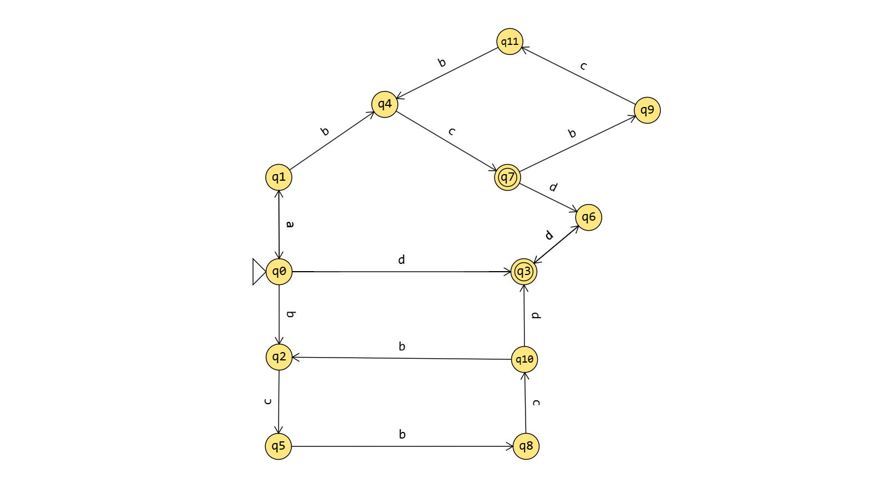

# Implementação de Autômatos Finitos

### Como executar:

* Compilação:
    
        g++ main.cpp -o main

*   Execução:

        ./main

### Diagrama de transição que representa matriz *tabela* e vetor *EF*:

*Construído em [Flap.js](https://flapjs.github.io/FLAPJS-WebApp/)